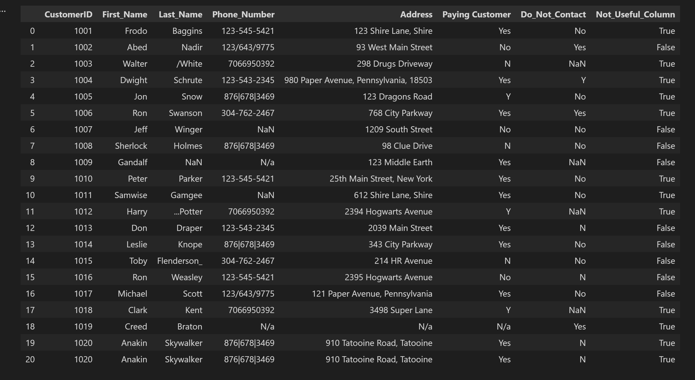
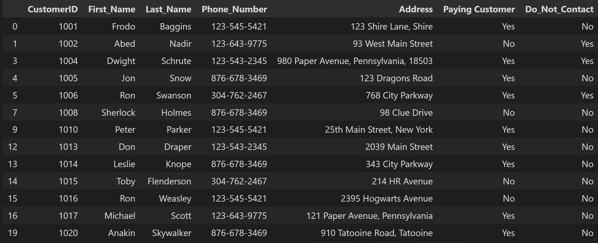

# Customer Call List Cleaning

Cleaning a messy customer contact list with Python (pandas) to make it ready for a call campaign.

## Before / After

## Problem
The raw data had several quality issues:
- Phone numbers in inconsistent formats (`123-545-5421`, `123/643/9775`, `876|678|3469`)
- Unwanted symbols in last names (`/White`, `...Potter`, `Flenderson_`)
- Mixed abbreviations and full words in Yes/No columns (`Y`/`N` vs `Yes`/`No`)
- Missing values (`NaN`, empty strings, `N/a`)
- Duplicate rows
- An unused column (`Not_Useful_Column`)

## Cleaning Steps
1. Loaded the data from Excel
2. Dropped the unused column
3. Cleaned last names with regex (`[^a-zA-Z]`)
4. Removed non-digit characters from phone numbers (`\D`)
5. Reformatted phone numbers to `XXX-XXX-XXXX`
6. Standardized `Paying Customer` and `Do_Not_Contact` to `Yes`/`No`
7. Handled missing values
8. Removed duplicate rows
9. Saved the cleaned dataset

## Tools
- Python
- pandas
- regex
- Jupyter Notebook (VS Code)

## Files
| File | Description |
|---|---|
| `clean.ipynb` | Full cleaning workflow |
| `data/customer_call_list.xlsx` | Original raw data |
| `data/clean_customer_call_list.xlsx` | Cleaned data |

## Results
- Consistent phone number format
- Clean last names
- Standardized Yes/No columns
- Duplicates removed
- Missing values handled

## Key Learnings
- Using `str.replace` with regex for text cleaning
- Converting data types (`astype(str)`) before string operations to avoid losing values
- Handling different kinds of missing values (`NaN`, `""`, `N/a`)
- Avoiding `inplace=True` on column selections (chained assignment)